# Linux Task-Based Assignment

## 1 - Use `cat /etc/passwd` and identify the different fields in one of the entries. Extract your own user's info and explain.
User info explained:

- sherif → username
- x → password placeholder (actual password is in /etc/shadow)
- 1000 → user ID (UID)
- 1000 → group ID (GID)
- sherif,,, → user’s comment
- /home/sherif → home directory
- /bin/bash → default shell

**Screenshot:**  
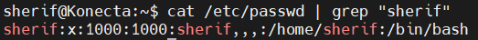  

---

## 2 - Explain the difference between the `cat` and `more` commands.
- `cat` → displays entire file content at once.
- `more` → displays file page by page; useful for large files.

**Screenshot:**  
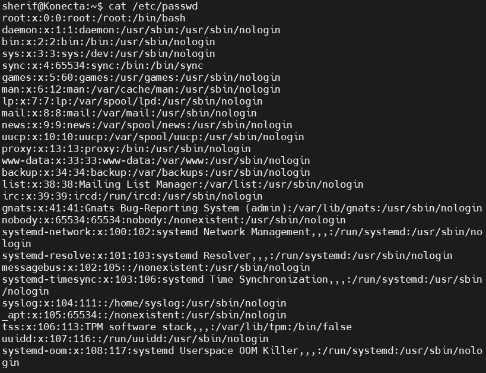  
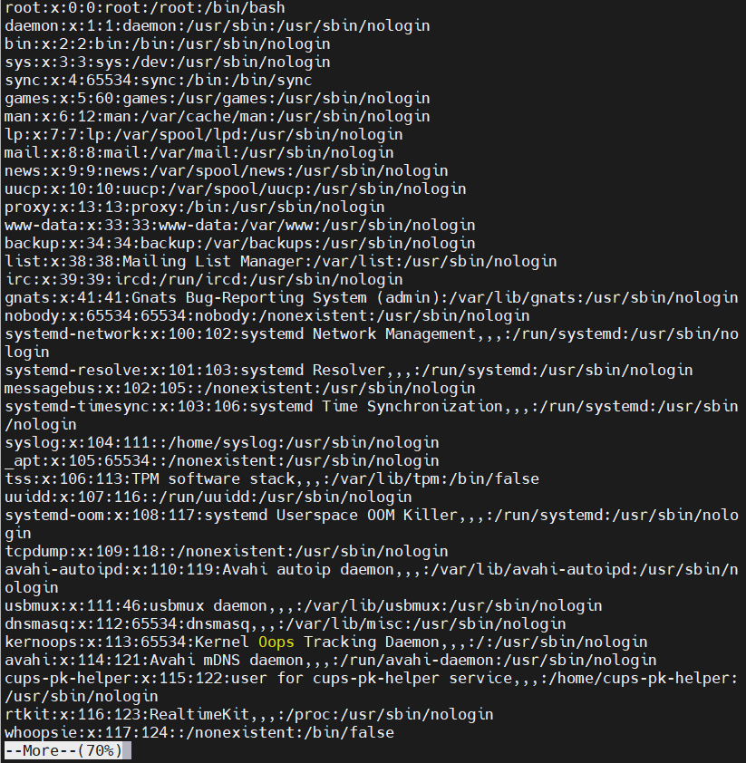  

---

## 3 - Explain the difference between the rm and rmdir commands.
- `rm` → removes files or directories (use `-r` for non-empty directories).  
- `rmdir` → removes only empty directories.

---

## 4 - Create directory structure and try removing dir11 using `rmdir` / `rm -r`
**Screenshot:**  
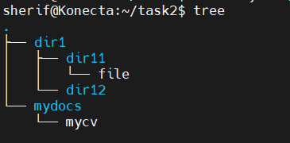  
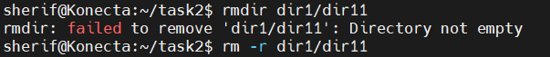  

**Explanation:**  
`rmdir` failed because `dir11` is not empty. Using `rm -r dir11` removes it recursively.

---

## 5 - Remove dir12 using `rmdir -p`
**Screenshot:**  
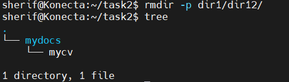  

**Explanation:**  
`rmdir -p` removes the directory and its parent if empty, simplifying hierarchy cleanup.

---

## 6 - Copy `/etc/passwd` to home and rename to mypassword
**Screenshot:**  
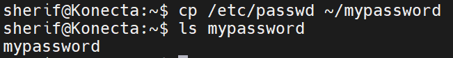  

---

## 7 - Rename mypassword to oldpasswd
**Screenshot:**  
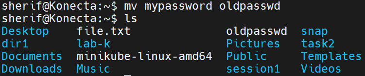  

---

## 8 - Explain the fields in `/etc/shadow`
**Screenshot:**  
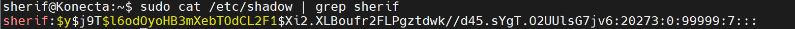  

**Explanation of fields:**

1. **Username** → `sherif`  
2. **Encrypted password** → `$y$j9T$l6odOyoHB3mXebTOdCL2F1$Xi2...`  
3. **Last password change** → `20273` (days since epoch)  
4. **Minimum password age** → `0` (days before user can change password)  
5. **Maximum password age** → `99999` (days before password must be changed)  
6. **Password warning period** → `7` (days before expiration user is warned)  
7. **Password inactivity period** → empty (`:`) → account inactive after password expires  
8. **Account expiration date** → empty → account never expires  
9. **Reserved field** → empty

---

## 9 - List all available Unix shells
**Screenshot:**  
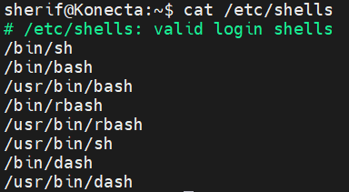  

---

## 10 - From `/usr/bin`, list 4 ways to go back to home
**Screenshot:**  
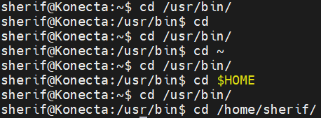  

---

## 11 - Display the first 4 lines of `/etc/passwd`
**Screenshot:**  
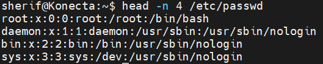  

---

## 12 - Display the last 7 lines of `/etc/passwd`
**Screenshot:**  
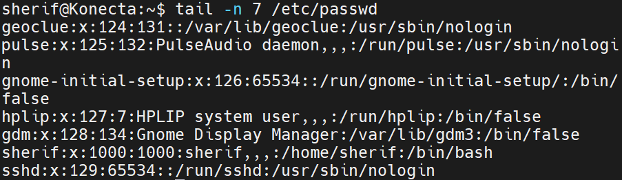  

---

## 13 - Display the users who are currently logged in
**Screenshot:**  
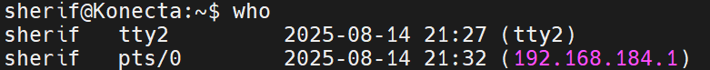  

---

## 14 - Display the number of user accounts in the system
**Screenshot:**  
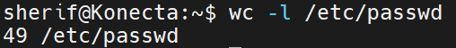  

---

## 15 - Create user islam
**Screenshot:**  
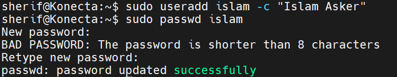  

---

## 16 - Create user baduser
**Screenshot:**  
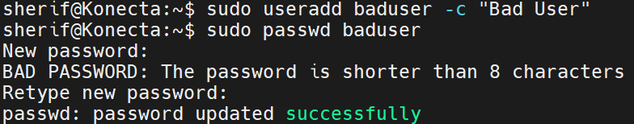  

---

## 17 - Create supplementary group pgroup
**Screenshot:**  
  

---

## 18 - Create supplementary group badgroup
**Screenshot:**  
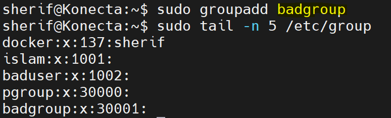  

---

## 19 - Add islam to pgroup as secondary group
**Screenshot:**  
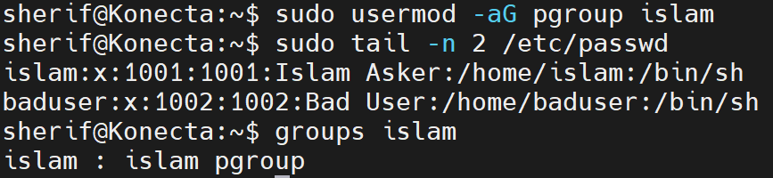  

---

## 20 - Change islam’s password to password
**Screenshot:**  
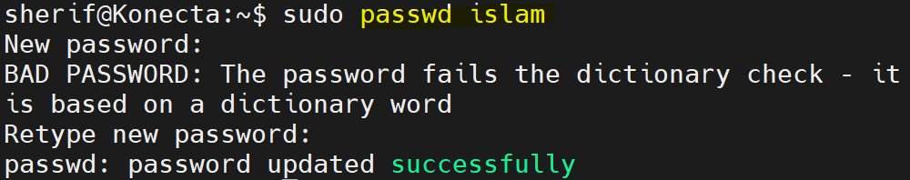  

---

## 21 - Set islam’s password to expire after 30 days
**Screenshot:**  
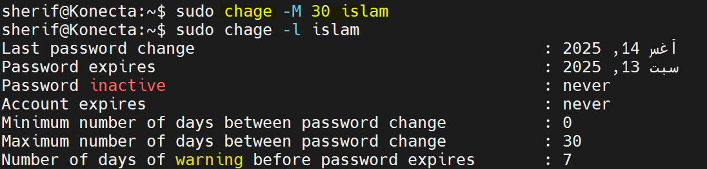  

---

## 22 - Lock the baduser account
**Screenshot:**  
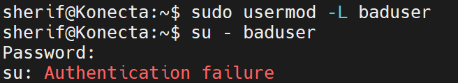  

---

## 23 - Delete the baduser account
**Screenshot:**  
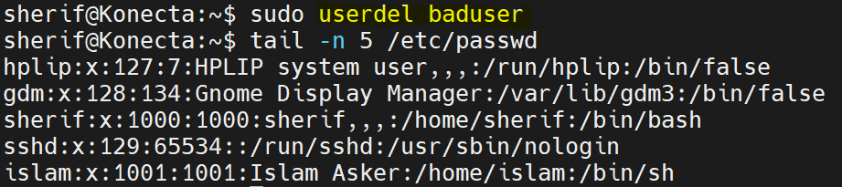  

---

## 24 - Delete the badgroup supplementary group
**Screenshot:**  
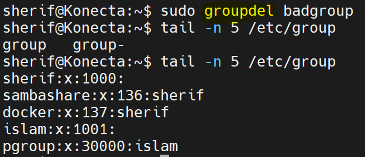  

---

## 25 - Create folder myteam and change permissions
**Screenshot:**  
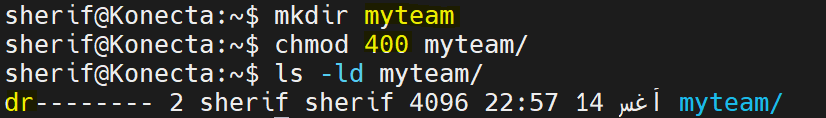  

**Explanation:**  
Permissions changed to read-only for owner (`chmod 400 myteam`).

---

## 26 - Log in as another user and try to cd into myteam
**Screenshot:**  
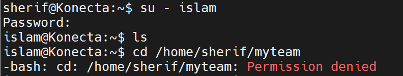  

**Explanation:**  
Other users cannot access folder because of restrictive permissions.

---

## 27 - Minimum permissions for file/directory operations 

**Explanation:**  
- Copy directory → read + execute  
- Copy file → read  
- Delete file → write + execute on parent dir  
- Change to directory → execute  
- List contents → read + execute  
- View file content → read  
- Modify file → write  

---

## 28 - Create file with 444 permissions and test
**Screenshot:**  
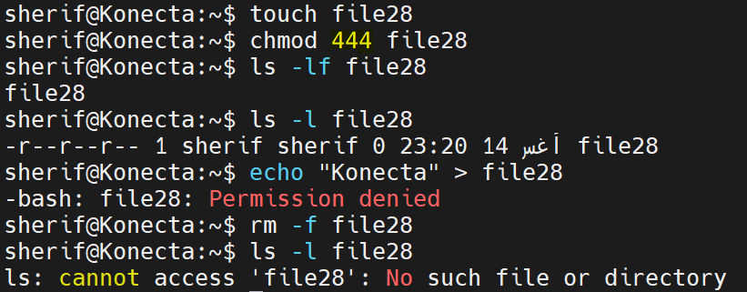  

**Explanation:**  
Cannot edit file (read-only), but can delete if parent directory allows write.

---

## 29 - Difference between x permission for file vs directory

**Explanation:**  
- File → allows execution if it's script
- Directory → allows entering/traversing  "cd into Directory"

---

## 30 - Configure a static IP address
**Screenshot:**  
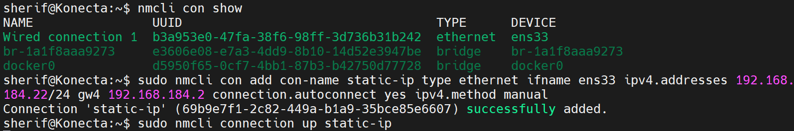  
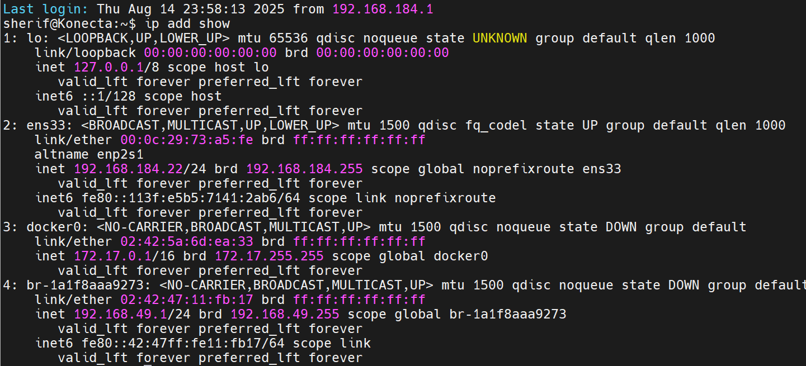  

---

## 31 - Test network connectivity using ping, traceroute, nslookup
**Screenshot:**  
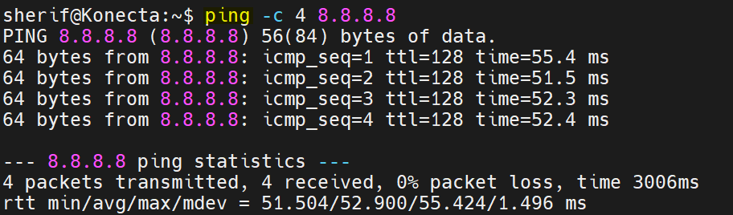  
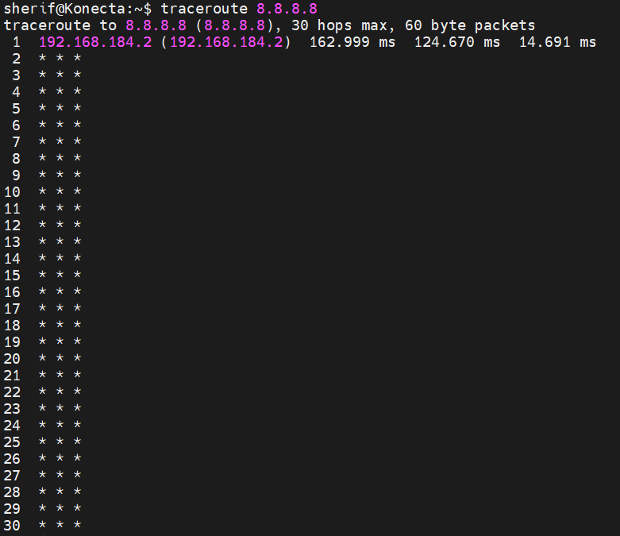  
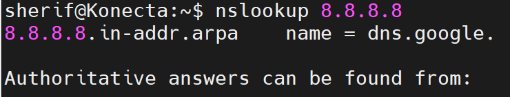  

---

## 32 - Firewall setup, enable, and allow port

**Explanation:**  
A firewall is a security tool that controls incoming and outgoing network traffic based on defined rules. It helps protect your system from unauthorized access while allowing authorized connections.

### On Ubuntu (UFW)
```bash
# Enable the firewall
sudo ufw enable

# Allow HTTP port 80
sudo ufw allow 80/tcp

# Check firewall status
sudo ufw status verbose
```
### On RHEL/CentOS (firewalld)
```bash
# Enable and start the firewall service
sudo systemctl enable firewalld
sudo systemctl start firewalld

# Allow HTTP port 80 permanently
sudo firewall-cmd --permanent --add-port=80/tcp

# Reload firewall to apply changes
sudo firewall-cmd --reload

# Check status and active rules
sudo firewall-cmd --list-all
```

---

## 33 - Run `sleep 50` in background, send it to background, find PID, and kill

**Screenshot:**  
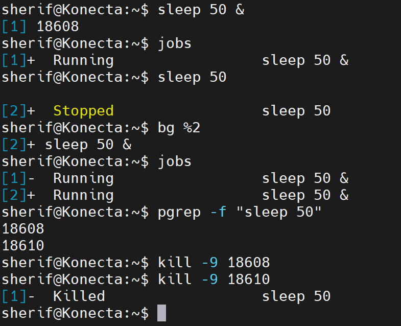

**Explanation:**  
- `sleep 50 &` → Start the command in the background.  
- `Ctrl+Z` then `bg` → Suspend a running job and move it to the background.  
- `jobs` → List background jobs with their PIDs.  
- `kill -9 <PID>` → Forcefully terminate the process using its PID.
